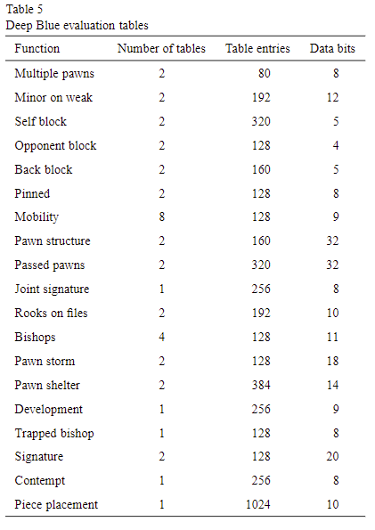
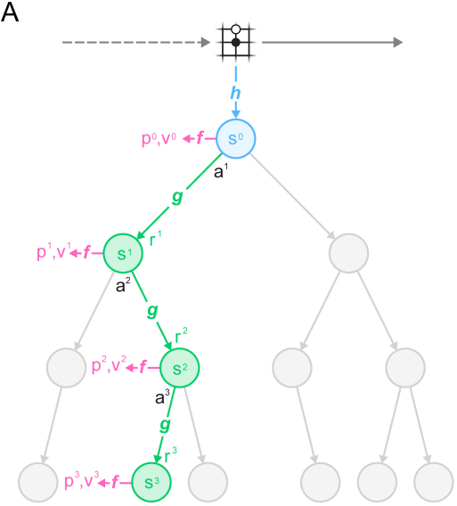
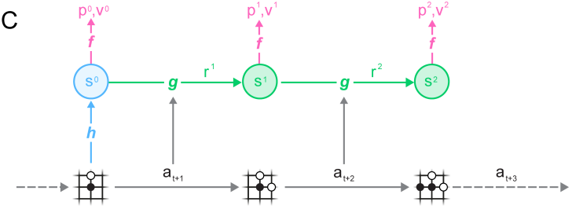

# MuZero and gym
This is a repo where I apply the MuZero reinforcement learning algorithm on the gym environments provided by OpenAI.

## Table of Contents
* [What is MuZero?](#what-is-muzero)
* [Thoughts](#thoughts)
* [What is gym?](#what-is-gym)
* [MuZero Technical Details](#muzero-technical-details)
* [File Descriptions](#file-descriptions)
* [Additional Resources](#additional-resources)

## What is MuZero?
Before we talk about MuZero, we have to mention and give context to its predecessors: AlphaGo, AlphaGo Zero and AlphaZero.

#### AlphaGo (2016)
[AlphaGo](https://storage.googleapis.com/deepmind-media/alphago/AlphaGoNaturePaper.pdf) is a reinforcement learning algorithm created by DeepMind that managed to defeat 18-time world champion Lee Sedol at Go in 2016 ([link to documentary](https://www.youtube.com/watch?v=WXuK6gekU1Y)). It was considered a huge feat in artificial intelligence at the time, as although AI algorithms were able to defeat the best chess players (see [Deep Blue vs Kasparov](https://en.wikipedia.org/wiki/Deep_Blue_versus_Garry_Kasparov)), there did not exist an AI algorithm that was capable of defeating professional Go players. This is due to the fact that Go has a significantly larger amount of possible board positions (10170) compared to chess (1043), and so the same algorithms that were used to create superhuman AI algorithms for chess, could not be used for Go. 

In addition, Deep Blue benefitted from game-specific knowledge; i.e. specific board positions and pattern structures were hard-coded into its evaluation function, which it uses to evaluate which board positions are favorable for itself (as seen on page 75 of the [Deep Blue paper](https://www.sciencedirect.com/science/article/pii/S0004370201001291)):

This knowledge specifically about the game of chess, was provided by chess grandmasters, who worked together with IBM to create Deep Blue.

With Go, however, such a hand-crafted, hard-coded evaluation function was difficult to create due to the nature of the game, and coupled with the fact that the number of possible board positions was much greater than chess, made it much harder to develop an AI algorithm that could achieve high levels of performance.

AlphaGo was able to solve this problem via a combination of reinforcement learning and deep neural networks. AlphaGo employs a search algorithm called Monte Carlo Tree Search ([MCTS](https://en.wikipedia.org/wiki/Monte_Carlo_tree_search)) to find the optimal move to play. It uses a policy neural network to limit the search breadth (the amount of possible moves to consider) and uses a value neural network to limit the search depth (the amount of turns into the future to consider), so that using MCTS in Go becomes tractable.

The neural networks in AlphaGo were first trained on pre-existing human games, and then later through self-play. Through this method, AlphaGo was able to make history and defeat Lee Sedol, one of the most reputable professional Go players in the world.

#### AlphaGo Zero (2017)
[AlphaGo Zero](https://www.nature.com/articles/nature24270.epdf?author_access_token=VJXbVjaSHxFoctQQ4p2k4tRgN0jAjWel9jnR3ZoTv0PVW4gB86EEpGqTRDtpIz-2rmo8-KG06gqVobU5NSCFeHILHcVFUeMsbvwS-lxjqQGg98faovwjxeTUgZAUMnRQ) employs a similar algorithm as AlphaGo, but rather than first training on human games, it learns entirely from scratch, through self-play. That is to say, AlphaGo Zero never sees human Go games, and so its knowledge of Go is based entirely on the games it plays against itself.

Through this method of training, AlphaGo Zero was able to defeat the previous AlphaGo 100 games to 0.

#### AlphaZero (2018)
[AlphaZero](https://arxiv.org/pdf/1712.01815.pdf) is a more generalized version of the AlphaGo Zero algorithm; not only can it be applied to Go, but also to chess and shogi. It was able to outperform the chess computer program Stockfish and the shogi computer program Elmo, both of which have won world championship computer tournaments in the past.

#### MuZero (2020)
[MuZero](https://arxiv.org/pdf/1911.08265.pdf) is the latest version of the algorithm, and it eliminates the pre-requisite of requiring a transition model of the environment. Search-based methods like MCTS can only be used if the algorithm has access to a transition model; essentially it needs to know the "rules" of the game (e.g. if I play a certain move, then the rules of the game will tell me what the new board state would look like), so that it can search for hypothetical moves in the future, to determine what is the optimal action to take now. Therefore the game rules were provided to AlphaGo, AlphaGo Zero and AlphaZero, so that it could facilitate this search.

In MuZero, however, the transition model is not provided. Instead, MuZero learns a transition model entirely through self-play. Using this method, MuZero was able to match and exceed AlphaZero's performance, but without the pre-requisite of requiring a transition model of the environment be provided.

## Thoughts
In our effort to make machines more intelligent, we tried to encode our knowledge and expertise of the domain we're working with into the machine. Deep Blue is an example of that; it is a monumental feat of engineering and collaboration between computer scientists and chess grandmasters, working together and pooling their knowledge and experience to create a machine capable of superhuman performance in chess. 

Yet, this approach has its limits. For one, the time and resources required to figure out what domain-specific knowledge would be useful for the machine to have, and then figure out how to quantify and hard-code this knowledge into a computer system is huge. Secondly, the knowledge we encode into the machine is domain-specific, meaning that encoding a computer system with chess-specific knowledge, will make the computer only good at playing chess. If we wanted to make a machine capable of playing Go at a high level, we would need to find professional Go players and redo the whole process of figuring out what sort of Go knowledge we think is useful to put into the computer system. This process has to be repeated for every unique domain we'd like to create an AI system for, which takes a lot of time and resources. Not to mention the fact that there may be domains that such experts don't exist currently, or the nature of the domain itself makes it hard to quantify a hard-coded evaluation function.

With the advent of machine learning, we can now take a different approach to making machines more intelligent. Rather than telling a machine explicitly what to look out for, and what we consider to be good or bad, we can use neural networks to have the machine learn these values for itself through its own experiences of self-play. AlphaGo was the first step in this direction; because of the nature of the game, coming up with a hard-coded evaluation function for Go was much more difficult compared to chess. So instead, DeepMind decided to let the machine learn for itself. After studying many human games and playing against itself over and over again, it was able to figure out what board positions in Go were considered good or bad, via its own experience. Rather than being provided a hard-coded evaluation function, AlphaGo learned its own evaluation function based on its own experience, and using that, was able to defeat Lee Sedol.

AlphaGo Zero removed the human element; it did not see any human Go games when training, and only learned through self-play. The fact that it was able to defeat AlphaGo 100 games to 0, perhaps hints at the idea that there are limits to knowledge solely derived from humans. Human knowledge of Go is deep; the game has been around for thousands of years, and the theory and strategy has been well developed and studied. Yet the computer program that was devoid of any human knowledge was able to defeat the computer program that was partially trained on human games 100 games to 0. It seems that the knowledge that we humans have gathered, may not be the most optimal, rather specifically in this example, our human bias served to hinder AlphaGo's performance. Indeed, we find in the research paper that AlphaGo Zero discovered new variations of well-established pattern sequences that were considered optimal in Go. And now these novel AI discoveries are in turn being studied by professional Go players (mentioned in an [interview](https://youtu.be/uPUEq8d73JI?t=5489) by David Silver, who lead the AlphaGo team). This idea is what makes me very excited as to what other novel things AI algorithms can show us...what other things have we accepted as "optimal", that can actually be improved upon, based on what AI algorithms can discover?

And it's not just in Go. AlphaZero shows us that the same algorithm used to achieve superhuman performance in Go, can also be applied to different domains in chess and shogi. No longer do we have to spend extra time and resources to hard-code domain-specific knowledge into the AI's evaluation functions, when we can use a general reinforcement learning algorithm to learn the evaluation function via self-play. This is extremely exciting, especially for problems where domain-experts may not even exist, like self-driving cars. The fact that AlphaZero was able to exceed Stockfish's performance in chess, considering the fact that Stockfish, at the time, was built quite similarly to Deep Blue in terms of hard-coded evaluation functions, gives further credence to the value of this type of reinforcement learning algorithm. 

The elimination of the need to provide a transition model, is another step toward the generalization of this reinforcement learning algorithm. It may seem trivial in the space of board games, where the rules and consequences of actions are well-defined. But for real-world applications, we would need a transition model that mimics the real world, in order to allow the machine to accurately learn and plan future actions accordingly. Unfortunately, the real world isn't as discrete and deterministic as the world of board games; it can be continuous and stochastic. Of course we can try to make approximations of the real-world, but they'll never be as good as the real thing. Fortunately with MuZero, the transition model itself can also be learned via self-play and experience! And with this algorithm, we're one step closer towards using artificial intelligence in real world applications.

Artificial intelligence has the potential to solve a lot of problems for us. The fact that it could potentially discover novel things that humans either prematurely dismissed as non-optimal, or never even considered, is exciting to me, especially in the fields of medicine, energy and finance. I think we're at an exciting period of time where AI technology is expanding at an exponential rate, and I can't wait to see what the future has in store for us!

## What is gym?
[gym](https://gym.openai.com/envs/) is a suite of virtual environments provided by OpenAI, to test reinforcement learning algorithms on. The suite contains everything from simple text games, to retro Atari games, to even 3D physics simulators. For this project, I apply the MuZero algorithm to 2D classic control environments. Below you can see some results:

## MuZero Technical Details
Below is a description of how the MuZero algorithm works in more detail.

### Data structures
MuZero is comprised of three neural networks: 
* A representation function, , which given an observation  from the environment, outputs a hidden state representation  of the observation at time 
	* The representation function is used in tandem with the dynamics function to represent the environment's state in whatever way the algorithm finds useful in order to make accurate predictions for the reward, value and policy
* A dynamics function, , which given a hidden state representation  and action  at time , outputs a new hidden state representation  and transition reward  at time 
	* The dynamics function is the learned transition model, which allows MuZero to utilize MCTS and plan hypothetical future actions on future board states
* A prediction function, , which given a hidden state representation , outputs a policy distribution over actions  and value  at time 
	* The prediction function is used to limit the search breadth by prioritizing searching promising actions more often via its policy output, and limit the search depth by using the value output as a substitute for a Monte Carlo rollout

A replay buffer is used to store the history of played games, and will be sampled from during training.

### Self-play
At every time step during self-play, the environment's current state is passed into MuZero's representation function, which outputs a hidden state representation. Monte Carlo Tree Search is then performed for a number of simulations specified in the config parameter. 

In each iteration, the tree is first traversed until a leaf node (non-expanded node) is selected. Selection of nodes is based on a modified UCB score that is dependent on the mean action Q-value and prior probability given by the prediction function. The mean action Q-value is min-max normalized to account for environments were the value is unbounded.

The leaf node is then expanded by passing the parent node's hidden state representation and the corresponding action into the dynamics function, which outputs the hidden state representation and transition reward for the leaf node.

The leaf node's hidden state representation is then passed into the prediction function, which outputs a policy distribution which serves as the prior probability for the leaf node's child nodes, and a value which is meant to be the predicted value of a "Monte Carlo rollout".

Finally, this predicted value is backpropagated up the tree, resulting in all nodes in the search path of the current iteration updating their mean action Q-values. The min and max values used in min-max normalization are updated if any of the nodes in the search path have new mean action Q-values that exceed the min-max bounds.

Once the simulations are finished, an action is sampled from the distribution of visit counts of every child node of the root node. A temperature parameter controls the level of exploration. Set initially high to encourage exploration, the temperature is gradually reduced to eventually make actions more greedy. The action selected is then executed in the environment and MCTS is conducted on the environment's next state until termination.

### Training
At the end of every game of self-play, MuZero adds the game history to the replay buffer and samples a batch to train on. The game history contains the state, action and reward history of the game, as well as the MCTS policy and value results for each time step.

For each game, a random position is sampled and is unrolled a certain amount of timesteps specified in the config parameter. The sampled position is passed into the representation function to get the hidden state representation. For each unrolled timestep, the corresponding action taken during the actual game of self-play is passed into the dynamics function, along with the current hidden state representation. In addition, each hidden state representation is passed into the prediction function to get the corresponding predicted policy and value for each timestep.

The predicted rewards outputted by the dynamics function are matched against the actual rewards received during the game of self-play. The predicted policies outputted by the prediction function are matched against the policies outputted by the MCTS search. 

The "ground truth" for the value is calculated using -step bootstrapping, where  is specified in the config parameter. If  is a number larger than the episode length, then the value is calculated using the actual discounted transition rewards of the game of self-play, and reduces to the Monte Carlo return. If  is less than or equal to the episode length, then the discounted transition rewards are used until the -step, at which the value outputted by the MCTS search is used to bootstrap. The predicted values outputted by the prediction function are then matched against these calculated values.

The three neural networks are then trained end-to-end, matching the predicted rewards, values and policies with the "ground truth" rewards, values and policies. L2 regularization is used as well.

(MuZero diagrams can be found on page 3 of their [paper](https://arxiv.org/pdf/1911.08265.pdf))

## File Descriptions
* `classes.py` holds data structure classes used by MuZero
* `main.py` holds functions for self-play, MCTS, training, testing and recording
	* `self_play` is the main function to call; it initiates self-play and trains MuZero
* `models/` holds saved neural network models used by MuZero
* `replay_buffers/` holds replay buffer instances, saved during self-play
* `assets/` holds media used in this `README.md`
* `requirements.txt` holds all required dependencies, which can be installed by typing `pip install requirements.txt` in the command line

For this project, I'm using Python 3.7.4.

## Additional Resources
* [Full interview with David Silver, who led the AlphaGo team](https://www.youtube.com/watch?v=uPUEq8d73JI)
* [DeepMind AlphaGo webpage](https://deepmind.com/research/case-studies/alphago-the-story-so-far)